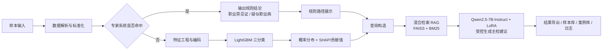

# 职业健康混合智能诊断与受控生成一体化平台

面向职业健康体检场景的混合智能辅助系统，提供从样本输入、主检结论判定、证据展示、检索增强、主检建议生成，到结果导出、案例沉淀和日志留痕的完整闭环。

本项目的目标不是单纯演示某个模型，而是将专家规则、机器学习、可解释分析、RAG 检索和 LoRA 微调大模型整合为一个可运行的平台原型，用于支撑职业健康体检场景下的主检辅助分析与受控建议生成。

## 1. 项目定位

职业健康体检业务具有三个典型特点：

- 结论判定既包含边界明确的规则型场景，也包含依赖多指标综合判断的复杂场景。
- 结果不仅要“给出结论”，还必须“说明依据”。
- 主检建议不能自由生成，必须与主检结论、异常信息和业务规范保持一致。

针对上述问题，本项目采用“专家系统优先 + LightGBM 补充 + SHAP 解释 + 混合检索 RAG + Qwen2.5-7B-Instruct LoRA 受控生成”的技术路线，构建了一个可视化平台。

## 2. 核心能力

- 样本输入：支持测试样本选择、手动录入、JSON 或文本文件上传。
- 混合诊断：专家系统优先命中职业禁忌证或疑似职业病；未命中时进入 LightGBM 三分类。
- 可解释输出：规则路径展示、异常项展示、SHAP 或特征贡献值展示、类别概率分布展示。
- 建议生成：基于向量召回与 BM25 的混合检索，结合本地 Qwen2.5-7B-Instruct + LoRA 生成结构化主检建议。
- 平台管理：内置样本数据库、专家案例库、操作日志、导出功能和基础登录能力。
- 工程保底：提供模型预热、异常兜底和模板保底建议生成，尽量保证平台不断链。

## 3. 技术路线



## 4. 系统模块说明

### 4.1 样本输入与数据预处理

- 支持三种输入方式：数据集测试样本、手动录入、文件上传。
- 对输入样本执行统一字段解析、空值清洗、数值提取和结构化组织。
- 为模型路径复用训练阶段特征工程逻辑，保证训练与推理一致。

### 4.2 混合智能诊断

- 专家系统用于优先识别职业禁忌证和疑似职业病。
- 未命中规则时进入 LightGBM 三分类：
  - 目前未见异常
  - 复查
  - 其他疾病或异常
- 输出诊断标签、诊断提示、判定来源和概率分布。

### 4.3 证据展示与结果解释

- 专家系统路径：展示规则命中路径与决策树轨迹。
- 模型路径：展示 SHAP 或特征贡献值。
- 附加展示重点异常项、关键检查和样本摘要。

### 4.4 主检建议受控生成

- 基于主检结论、异常项、岗位信息和危害因素构造查询。
- 使用向量召回与 BM25 稀疏召回融合获取知识片段。
- 将样本有效信息、结论、证据和检索片段组织为受约束提示。
- 调用本地 Qwen2.5-7B-Instruct 与 LoRA 适配器生成结构化主检建议。

### 4.5 结果管理

- 建议文本导出
- 完整报告导出
- 样本数据库
- 专家案例库
- 操作日志

## 5. 项目目录说明

当前仓库主要目录和文件说明如下：

```text
.
├─ app.py                          # Gradio 服务启动入口
├─ gradio_case_app.py              # 前端界面与交互逻辑
├─ gradio_ui.css                   # 平台界面样式
├─ occupational_health_runtime.py  # 核心运行时：诊断、检索、建议生成
├─ local_qwen_advice.py            # 本地 Qwen + LoRA 推理封装
├─ platform_storage.py             # SQLite 数据库、案例库与日志管理
├─ train.py                        # 历史训练脚本
├─ data_process.py                 # 数据清洗与预处理逻辑
├─ expert_rules.json               # 专家规则库示例
├─ rag/                            # RAG 知识库片段
├─ processed_data/                 # 特征信息、编码器、缩放器等处理产物
├─ saved_models/                   # 训练好的 LightGBM 模型
├─ models/                         # 本地基础模型目录
├─ model_offload/                  # 本地模型 offload 缓存
├─ demo_test_samples.json          # 测试样本
├─ sample_record.json              # 最小化示例输入
├─ start_platform.ps1              # PowerShell 启动脚本
└─ 启动平台.bat                    # Windows 双击启动脚本
```

## 6. 运行环境

建议环境：

- 操作系统：Windows 10 / Windows 11
- Python：3.11
- 内存：建议 16GB 及以上
- 推理设备：
  - CPU 可运行，但本地 7B 模型生成会较慢
  - 如有 NVIDIA GPU，可进一步优化推理速度

主要依赖见 [requirements.txt](./requirements.txt)，核心包括：

- `gradio`
- `lightgbm`
- `scikit-learn`
- `shap`
- `faiss-cpu`
- `rank-bm25`
- `transformers`
- `torch`
- `peft`
- `accelerate`

## 7. 开源版需要自备内容

如果你准备使用本项目，以下内容应优先确认是否存在：

- 原始职业健康体检数据，如 `data.pkl`

## 8. 运行前准备

### 8.1 安装 Python 依赖

```powershell
pip install -r requirements.txt
```

### 8.2 准备数据、模型和知识库

本项目运行时默认依赖以下内容：

| 类型 | 默认位置 | 说明 |
|---|---|---|
| 原始数据 | `data.pkl` | 用于抽取测试样本或回放样本 |
| 专家规则 | `expert_rules.json` | 规则树配置 |
| 特征处理产物 | `processed_data/` | 特征名、编码器、缩放器等 |
| 分类模型 | `saved_models/LightGBM.pkl` | LightGBM 主检三分类模型 |
| RAG 知识库 | `rag/` | JSON / JSONL 片段库 |
| Qwen 基座 | `models/Qwen2.5-7B-Instruct/` | 本地基础模型 |
| LoRA 权重 | `LLaMA-Factory/saves/...` | 微调适配器目录 |

如果缺少本地大模型，平台仍可运行部分流程，但建议生成模块将无法完整体现预期能力。

## 9. 快速启动

### 9.1 方式一：命令行启动

```powershell
python app.py
```

启动成功后，默认访问地址通常为：

- [http://127.0.0.1:7860](http://127.0.0.1:7860)

### 9.2 方式二：Windows 双击启动

直接双击：

- `启动平台.bat`

该脚本会调用：

- `start_platform.ps1`

并尝试自动打开浏览器。

## 10. 登录说明

当前平台内置了一个默认账号，用于本地演示：

- 用户名：`admin`
- 密码：`admin123`

注意：

- 建议移除默认明文密码，改为环境变量、初始化脚本或首次启动创建管理员的方式。

## 11. 使用流程

### 11.1 输入样本

平台首页左侧为样本输入区，支持以下方式：

- 选择“数据集测试样本”
- 切换到“手动录入”并粘贴 JSON
- 切换到“文件上传”并上传 JSON 或文本

### 11.2 执行分析

点击“开始分析”后，系统依次完成：

1. 样本标准化与摘要生成
2. 专家系统优先判定
3. LightGBM 三分类补充判定
4. 证据生成与概率展示
5. RAG 检索
6. 本地 Qwen + LoRA 受控生成主检建议
7. 样本记录写入数据库

### 11.3 查看结果

右侧主要结果区会展示：

- 主检结论
- 判定来源
- 诊断提示
- LightGBM 概率分布
- 规则路径或模型路径
- 异常项与判定依据
- 结构化主检建议

### 11.4 结果管理

底部或页签区域支持查看：

- 样本数据库
- 专家案例库
- 操作日志
- 系统信息

### 11.5 导出结果

分析完成后，可导出：

- 建议文本
- 完整报告

## 12. 输入格式说明

### 12.1 JSON 格式

推荐使用 JSON 作为输入格式，例如：

```json
{
  "性别2": "男",
  "年龄3": 32,
  "工种21": "热工仪表修理工",
  "总工龄22": "7年0月",
  "接害工龄23": "7年0月",
  "接触危害因素25": "噪声",
  "收缩压结果42": 128,
  "舒张压结果45": 85,
  "胸部正位片结果判断96": "未见异常",
  "双耳高频平均听阈结果35": 17.7,
  "双耳语频平均听阈结果32": 0
}
```

### 12.2 键值文本格式

也支持简单的 `key:value` 或 `键：值` 文本，例如：

```text
性别2: 男
年龄3: 32
工种21: 热工仪表修理工
总工龄22: 7年0月
接害工龄23: 7年0月
接触危害因素25: 噪声
双耳高频平均听阈结果35: 17.7
```

## 13. 模型与推理说明

### 13.1 专家系统

- 规则定义文件：`expert_rules.json`
- 用途：优先识别职业禁忌证、疑似职业病等高确定性场景
- 输出：规则结论、诊断提示、规则路径

### 13.2 LightGBM 模型

- 模型文件：`saved_models/LightGBM.pkl`
- 训练脚本：`train.py`
- 作用：对未命中专家规则的样本进行三分类
- 输出：类别、概率分布、特征贡献

### 13.3 RAG 检索

当前实现采用混合检索：

- Embedding 名称：`bge-base-zh-v1.5`
- 向量检索：FAISS
- 稀疏检索：BM25
- Top-K：默认 7

知识库片段建议使用 JSONL 管理，便于审查、维护和增量扩展。

### 13.4 大模型生成

- 基础模型：Qwen2.5-7B-Instruct
- 微调方式：LoRA
- 生成参数：
  - `temperature = 0.1`
  - `top_p = 0.9`
  - `max_new_tokens = 1024`

应用启动时会尝试后台预热本地 Qwen + LoRA，以减轻首次点击“开始分析”时的等待。

## 14. 数据库与平台状态

系统默认使用 SQLite 记录业务运行信息，主要包括：

- `users`
- `sample_records`
- `expert_case_library`
- `operation_logs`

数据库默认文件为：

- `platform_data.db`

如果公开仓库，建议不要提交真实业务运行数据库，可在首次启动时自动创建空库。

## 15. 界面展示

平台界面主要包括登录界面、主分析界面和数据管理界面三部分，分别用于用户身份认证、职业健康体检样本分析以及历史记录管理与结果追溯。整体界面采用模块化布局方式，将样本输入、智能诊断、证据展示、主检建议生成和结果管理等功能集成于统一工作台中，便于用户按照业务流程完成操作。


1. 登录界面
登录界面用于平台访问控制和用户身份确认。页面顶部展示平台名称，中心区域提供用户名和密码输入框，并设置登录按钮完成身份认证。该界面用于保证后续分析记录、案例保存和操作日志均能够与具体用户关联，为系统留痕管理和权限控制提供基础。


2. 主分析界面
主分析界面是平台的核心工作界面，整体采用左右分栏布局。

左侧区域主要用于样本输入与样本概览，包含以下内容：

样本输入模块：支持数据集测试样本选择、手动录入和文件上传三种输入方式。
样本操作按钮：用于触发分析流程。
当前样本展示区：用于显示当前载入的结构化样本内容，便于用户核对输入信息。
样本摘要区：对样本中的基础信息、职业暴露信息、关键检查项目、重点异常项和暴露标签进行结构化展示，帮助用户快速把握样本特征。
右侧区域主要用于分析结果展示，包含以下内容：

检测结论区：展示主检结论、判定来源和诊断提示等关键信息。
概率展示区：当样本进入机器学习判定路径时，展示 LightGBM 三分类概率分布；若样本直接命中专家系统，则显示相应说明。
规则路径/模型路径区：用于展示专家系统命中的规则链路，或机器学习模型的判定路径信息。
异常项与判定依据区：用于展示样本中的关键异常项，以及 SHAP 值或特征贡献等解释信息。
主检建议区：展示经 RAG 检索和微调大模型生成的结构化主检建议，通常包括岗位处置建议、复查或转诊建议、职业防护与随访建议以及提示说明。
结果导出区：支持导出建议文本和完整报告，便于结果存档和后续使用。

此外，主分析界面顶部还设置当前用户显示和退出登录按钮，并配有状态提示栏，用于反馈当前系统状态和分析进度。


3. 数据管理界面
平台在主界面下方或页签区域集成了数据管理功能，包括分析过程、样本数据库、专家案例库、操作日志和系统信息等页面。

分析过程页：用于展示一次分析任务的执行过程，包括诊断流程、证据来源和生成过程信息，便于用户理解系统运行逻辑。
样本数据库页：用于展示历史分析记录，支持按照关键词、主检结论和判定来源进行检索与筛选，并可点击某条记录回填到分析界面重新复盘。
专家案例库页：用于存储典型案例及专家标注信息，支持案例检索、查看和回填分析。
操作日志页：用于记录用户登录、分析、导出、案例保存等关键操作，满足过程审计和运行追踪需求。
系统信息页：用于展示模型状态、知识检索配置、预热状态等运行信息，便于系统维护与监控。

## 16. 常见问题

### Q1：为什么第一次分析很慢？

因为应用启动后会后台预热本地 Qwen + LoRA；如果预热未完成或模型较大，首次生成会明显慢于普通页面操作。

### Q2：没有本地 Qwen 模型还能运行吗？

可以运行部分流程，但主检建议生成能力会受限。建议在公开说明中明确区分：

- 代码仓库可直接运行的部分
- 需要额外下载模型后才能运行的部分

### Q3：为什么别人克隆后不一定能直接运行？

当前实现仍包含开发机绝对路径和本地资产依赖。若未完成配置化改造，其他用户需要先调整路径和资源位置。

## 17. 适合公开仓库的发布方式建议

推荐采用以下发布策略：

- 仓库公开代码、文档、示例规则和脱敏样例
- 数据与模型通过单独下载地址或 Release 附件提供
- 在 README 中明确说明哪些资源默认不随仓库提供
- 首次公开先发 `v0.x`，标注为研究原型或演示版本

## 18. 免责声明

本项目仅用于科研、教学、原型验证和技术交流，不构成医疗诊断意见，也不能替代职业健康主检医师的专业判断。涉及真实职业健康数据、体检结论或职业病诊断时，请严格遵守所在机构的数据治理、伦理审查和法律法规要求。

## 19. 致谢与引用

如果你将本项目用于论文、研究或二次开发，建议在后续版本中补充：

- 论文引用信息
- 数据来源说明
- 知识库来源说明
- 模型来源与许可证说明

## 20. 许可证

本仓库当前尚未附带许可证文件。正式公开前，请根据你的开源意图选择合适的许可证，例如：

- MIT：限制少，适合工具型项目
- Apache-2.0：包含专利授权条款，适合工程项目
- GPL-3.0：强调衍生项目继续开源

在未明确附加许可证前，默认不建议第三方直接复制、分发或商用本仓库内容。
